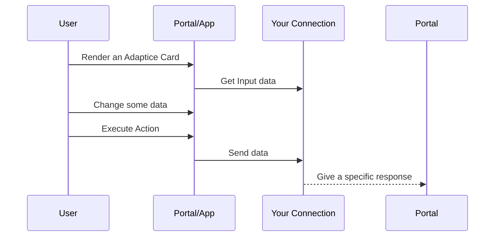

# Adaptive Cards

## Introduction
Adaptive cards are a way of displaying information across different platforms and devices. They are designed to be easily integrated into applications and services, and can adapt to different screen sizes and user interfaces. Adaptive cards are particularly useful for displaying data in a visually appealing and interactive way. At Synigo We have incorporated adaptive cards into our system to allow our users to create adaptive cards and display them in a wide variety of ways.

## Usage
Adaptive cards can be used for a wide range of purposes, including displaying notifications, presenting data, and collecting user input. Here are some examples of how adaptive cards can be used:  

1.  **Notifications:** Adaptive cards can be used to display notifications to users in a visually appealing way, whether it's a simple message or a more complex alert with interactive elements.  
    
2.  **Data presentation:** Adaptive cards are great for presenting data such as news articles, weather forecasts, and sports scores. They can be customized to include images, charts, and other visual elements to make the information more engaging.  
    
3.  **Forms:** Adaptive cards can be used to collect user input, such as for surveys, polls, or quizzes. They can include different types of input fields, such as text boxes, drop-down menus, and checkboxes.  
    
4.  **Messaging:** Adaptive cards can be used in messaging platforms such as Microsoft Teams or Slack to send rich, interactive messages to users. They can include buttons, images, and other elements to make the messages more engaging. 

## Adaptive cards in Synigo Pulse
### Presentation
In Synigo Pulse we wrapped adaptive cards in a process and users are able to (re)use this process in a variety of ways:
- **Process Widget:** This widget renders an adaptive card in a single reusable widget.
- **Processes Widget:** This widget displays processes as a list, here you can select one and it will be rendered in a dialog.
- **Process Menu Item:** This will render an Adaptive Card in our native app.
### Getting Data
A process uses connections to get and send data. It does not necessarily need connections, you could create a static card. If you want to have a visualisation of  data, you need to add an incoming connection. When displaying the card, this connection is used to get the data and add it to the $data context of the adaptive card. 
### Sending data
If you need to send data to a service, you need to define actions within your adaptive card. These action needs to have **verb** which we use to bind an outgoing connection. 

```json
{
	"type": "ActionSet",
	"actions": [
	{
		"type": "Action.Execute",
		"title": "Submit",
		"verb": "connection-submitdata"
	}]
}
```
(The sample above will ask you to add a connection for the connection-submitdata verb)

### connection types
Within our platform you can define two types of connections:
- **HTTP connection:** this is a simple HTTP connection, you can configure this to be a GET, POST, PUT,.. connection, with optional headers and a body and what not.
- **One API connection:** This is a connection which is configured in your main portal settings and is generated using the accompanied Open API Specification, and OAuth Authentication.

The figure below is a representation of the adaptive cards in Synigo Pulse.


## How will this work
The diagram gives an overview about how this process will work: The user does something so that the portal or app needs to render a card. If there's an input connection defined, it will call this connection and get the data. The user can then manipulate this data and execute an action to send the manipulated data. Based on the response, the portal or app will behave in a certain way.


## Handling the response of the service
Based on the response, the portal or app will act in a different way. We comply (as best as we can to the [Universal Action Model](https://learn.microsoft.com/en-us/adaptive-cards/authoring-cards/universal-action-model) However we have added some additional instructions.

#### Response format

The HTTP response's status code returned by the Service must be equal to 200 and the body of the HTTP response must be formatted as follows:

```
{ 
    "statusCode": <number (200 – 599)>, 
    "type": "<string>", 
    "value": "<object>",
    "hint": "<string>",
    "cardReference": "<string>"
} 
```
Field

Description

**statusCode**

An HTTP response status code of 200 does NOT necessarily mean the Bot was able to  _successfully_  process the request. A client application MUST always look at the  `statusCode`  property in the response's body to know how the Bot processed the request.  `statusCode`  is a number ranging from 200-599 that mirrors HTTP status code values and is meant to be a sub-status for the result of the bot processing the Invoke. A missing, null, or undefined value for  `statusCode`  implies a 200 (Success).

**type**

A set of well-known string constants that describe the expected shape of the value property

**value**

An object that is specific to the type of response body

**hint**
The hint indicates what to do next. For know we only except `showDialog` This means the service wants to show the result in another dialog.

**cardReference**
If the hint is `showDialog` You can use this property to add the ID of the process (Adaptive Card) to render as a dialog. note that the type must be of `application/vnd.microsoft.card.adaptive`

**Supported status codes**
The following table lists the allowed values for  `statusCode`,  `type`, and  `value`  in the Bot's response body:


|Status Code|Type|Value|Notes|
|--|--|--|--|
|200|`application/vnd.microsoft.card.adaptive`|`Adaptive Card`|The request was successfully processed, and the response includes an Adaptive Card that the client should display in place of the current one.|
|200|`application/vnd.microsoft.activity.message`|`string`|The request was successfully processed, and the response includes a message that the client should display.|
|500|`application/vnd.microsoft.error`|[Error Object](https://learn.microsoft.com/en-us/dotnet/api/system.exception?view=net-7.0)|An unexpected error occurred.|

**How the portal/app will act:**
|StatusCode|Type|Hint|CardReference|Action|
|--|--|--|--|--|
|200|application/vnd.microsoft.card.adaptive|showDialog|[some-id]|We will render a new card in a dialog and use the data in the field `value` as the `$data` context of the rendered card.
|200|application/vnd.microsoft.card.message|not used|not used|We will use the `value` field to show a toaster and then refresh the adaptive card.
|500|not used|not used|not used|We try get and show the `exception.Message` in a toaster. 

### Handling languages
The portal and or app will send an `Accept-Language` header with the preferred language code in there...

## Some useful links
- [https://adaptivecards.io/](https://adaptivecards.io/)
- [https://learn.microsoft.com/en-us/adaptive-cards/authoring-cards/universal-action-model](https://learn.microsoft.com/en-us/adaptive-cards/authoring-cards/universal-action-model)
- https://learn.microsoft.com/en-us/azure/bot-service/adaptive-expressions/adaptive-expressions-prebuilt-functions?view=azure-bot-service-4.0
